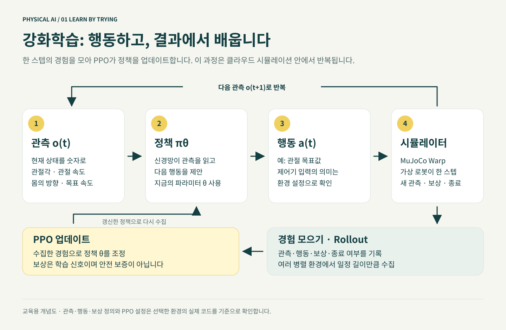
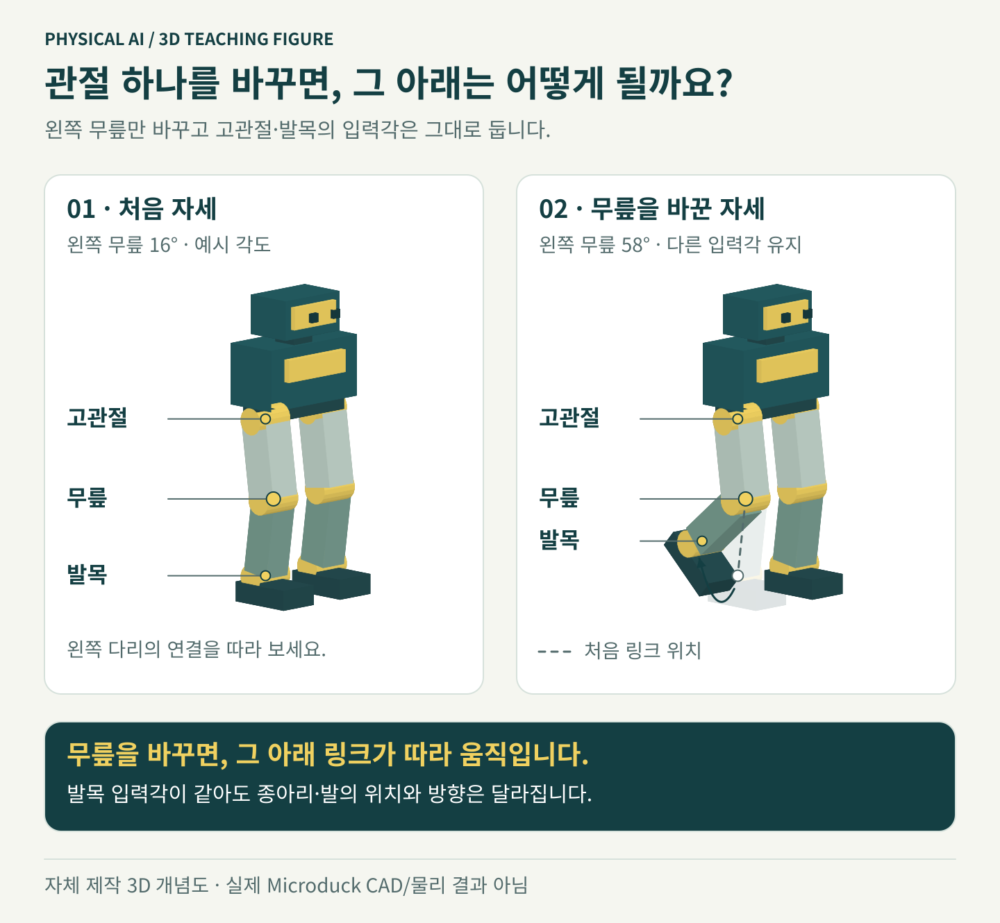

# 관찰하고, 움직이고, 다시 배우기

예상 시간: 20분. 준비물: 브라우저와 인터넷. 이번 단계에서는 AWS 실습 리소스나 실물 로봇을 사용하지 않습니다.

## 아주 작은 예

사람이 한 발을 들 때 몸을 반대쪽으로 기울여 균형을 잡듯, 로봇도 여러 관절을 함께 조절해야 합니다. 보행 정책은 현재 몸 상태와 원하는 이동 방향을 받아 다음 관절 목표값을 정하는 함수입니다.

| 단어 | 쉬운 뜻 | 이 실습의 예 |
|---|---|---|
| 관측 observation | 지금 몸이 어떤 상태인지 | 관절 위치·속도, 몸의 기울기·회전, 이전 행동 |
| 명령 command | 무엇을 하고 싶은지 | 앞으로 천천히 걷기 |
| 행동 action | 다음에 관절을 어디로 보낼지 | 다리·목·머리의 14개 목표값 |
| 보상 reward | 목표에 얼마나 가까웠는지 주는 점수 | 속도 추종, 균형 유지, 부드러운 움직임 |
| 정책 policy | 관측을 행동으로 바꾸는 모델 | 학습한 신경망 |
| 에피소드 episode | 한 번의 연습 | 시작 → 걷기 → 넘어짐 또는 시간 종료 |

PPO는 한 번에 정책을 지나치게 바꾸지 않도록 조절하며 개선하는 강화학습 방법입니다. 첫 실습에서는 수식과 보상 함수를 직접 수정하지 않고 공식 설정을 사용합니다.

## 관절 하나가 바뀌면 어디까지 움직일까요?

고관절 → 무릎 → 발목은 이어진 연결 구조입니다. 무릎 각도를 바꾸면 종아리와 발의 위치가 함께 바뀝니다. 그래서 “발을 앞으로 보내기”도 여러 관절의 조합으로 만들어집니다. 그림의 각도는 설명용이며 실제 로봇에 보낼 명령값이 아닙니다.

직접 확인하려면 [관절을 움직이며 이해하기](../../static/visuals/joint-concepts-3d.html)를 여세요. **측면**에서 왼쪽 무릎 슬라이더만 움직인 뒤, 어느 부분은 그대로이고 어느 부분이 따라 움직이는지 찾아보세요. 인터넷 없이 사용할 수 있으며 Module 5에서 관측·행동과 연결해 다시 실습합니다.

## 클라우드가 하는 일과 로봇이 하는 일

클라우드 GPU는 많은 가상 로봇의 연습을 병렬로 계산합니다. 학습한 결과를 ONNX라는 모델 파일로 내보냅니다. 실제 로봇은 그 파일을 읽어 **로봇 내부에서 초당 50번** 관측과 행동 계산을 반복합니다. 인터넷으로 매 순간 모터 명령을 보내는 구조가 아닙니다.

실제 로봇과 시뮬레이터는 완전히 같지 않습니다. 배터리 전압, 마찰, 모터의 지연·유격 등이 다릅니다. 공식 학습은 BAM 액추에이터 모델과 domain randomization으로 이 차이를 줄이지만, 실물 확인을 대신하지는 않습니다.

## 직접 해 보기

[공식 온라인 Microduck 시뮬레이터](../../static/visuals/biped-3d.html)를 열고 제공자 화면의 안내에 따라 동작을 살펴보세요. “원하는 이동 명령과 로봇이 실제로 보이는 움직임은 어떻게 다른가”를 생각해 보세요. 조작 방법은 공식 앱의 현재 안내를 따릅니다.

인터넷 연결과 제공자 서비스 가용성이 필요합니다. 교재 안에서 열리지 않으면 [공식 Hugging Face Space](https://huggingface.co/spaces/pollen-robotics/microduck-simulator)에 직접 접속하세요. 서비스가 중단되면 위의 관측·행동 그림으로 개념 학습을 계속할 수 있습니다.

이 데모는 AWS GPU 학습이나 내 체크포인트 재생과 별개이며 실제 로봇·모터에 연결하지 않습니다. 화면에서 로봇이 움직여도 내가 보행 정책을 학습·검증한 것은 아닙니다. 교재는 제공자 앱을 임베드·링크하며 자산을 재배포하지 않습니다. 임베드는 모델의 NC 조건이나 상업 이용 권한을 바꾸지 않으며, 다음 단계의 다운로드·학습 전 권한 확인은 그대로 적용됩니다.

**확인:** GPU 없이도 정책·관측·행동의 차이를 말할 수 있으면 통과입니다.

**기억할 점:** 보상이 높아져도 로봇이 제자리에서 서 있는 방법만 배웠을 수 있습니다. 실제 행동을 봐야 합니다.

[← 전체 과정](../index.ko.md) · [다음: 준비와 라이선스 →](../module2-prerequisites/index.ko.md)
