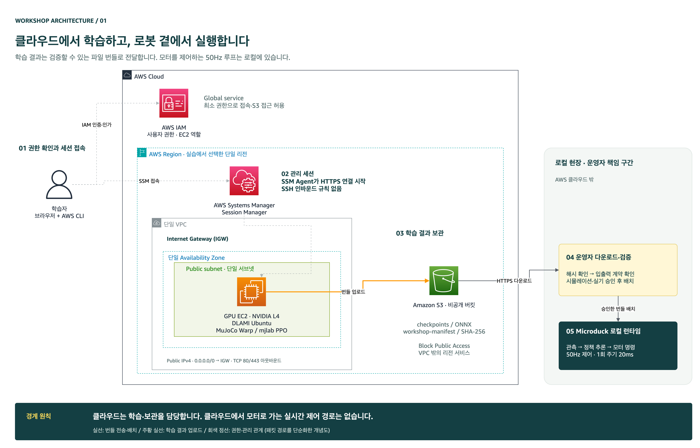

# 접속 포트를 열지 않고 GPU 사용하기

예상 시간: 20~40분. 실행 위치: **내 컴퓨터의 워크샵 폴더**. 이 단계는 AWS 리소스를 만들고 비용이 발생합니다. [준비 조건](../module2-prerequisites/index.ko.md)을 완료한 계정에서 진행하세요.



## 1. 리전과 AMI 선택

EC2 콘솔에서 실습 리전을 선택한 뒤 Amazon이 제공하는 **Deep Learning GPU AMI, Ubuntu 22.04 또는 24.04, x86_64**를 찾습니다. NVIDIA 드라이버가 포함되어 있어야 합니다. AMI ID는 리전마다 다르고 계속 갱신되므로 교재에 고정하지 않았습니다. Marketplace 제품 또는 다른 계정의 비슷한 이름을 선택하지 마세요.

```bash
export AWS_REGION=us-west-2
export STACK_NAME=physical-ai-microduck
export AMI_ID=ami-실제선택한ID
python3 scripts/cloud/manage.py check --region "$AWS_REGION"   --stack "$STACK_NAME" --ami-id "$AMI_ID" --instance-type g6.2xlarge
```

검사는 AWS 소유자·아키텍처·GPU 종류·AZ 제공 여부·G/VT vCPU와 VPC 한도 등을 확인합니다. 실제 GPU 재고나 드라이버 부팅까지 보장하는 검사는 아닙니다. 실패하면 오류를 해결한 뒤 다시 검사하세요. 자세한 기준은 [클라우드 실행 계약](../../docs/cloud-contract.md)에 있습니다.

## 2. 새 스택 배포

```bash
python3 scripts/cloud/manage.py deploy --region "$AWS_REGION"   --stack "$STACK_NAME" --ami-id "$AMI_ID" --instance-type g6.2xlarge
python3 scripts/cloud/manage.py status --region "$AWS_REGION" --stack "$STACK_NAME"
```

새 VPC, public subnet, GPU EC2 한 대, SSM 역할, private S3 버킷을 만듭니다. 인바운드 포트는 없고 SSM으로 접속합니다. S3는 VPC 내부 서비스가 아니며 HTTPS로 접근합니다. EC2가 public subnet에 있어도 외부에서 SSH나 뷰어 포트로 들어올 수 없습니다.

출력에서 `TrainingInstanceId`와 `ArtifactBucketName`을 기록합니다. 스택 생성 뒤 SSM이 아직 연결되지 않아 명령이 시간 초과되어도 인스턴스는 과금될 수 있습니다. 상태를 확인하고 종료 모듈을 사용하세요.

## 3. 교재 ZIP을 GPU 호스트로 전달

배포물 ZIP을 워크샵 폴더 바로 위에 놓습니다. 소스에서 작업한다면 `python3 scripts/package_workshop.py`로 먼저 만드세요.

```bash
export TRAINING_INSTANCE_ID=i-출력의인스턴스ID
export ARTIFACT_BUCKET=출력의버킷이름
aws s3 cp ../physical-ai-from-cloud-to-robot.zip   "s3://$ARTIFACT_BUCKET/workshop/source.zip" --region "$AWS_REGION"
aws ssm start-session --region "$AWS_REGION" --target "$TRAINING_INSTANCE_ID"
```

이제 **SSM 셸 안**입니다. 사용자와 작업 위치를 바꿉니다. 리전·버킷 변수는 내 컴퓨터 셸에서 자동 전달되지 않습니다. 아래 `실제배포리전`은 앞에서 선택한 값(예: `us-west-2`)으로 바꾸세요.

```bash
sudo -iu ubuntu
export AWS_REGION=실제배포리전
export ARTIFACT_BUCKET=출력의버킷이름
mkdir -p "$HOME/workshops"
aws s3 cp "s3://$ARTIFACT_BUCKET/workshop/source.zip"   "$HOME/workshops/source.zip" --region "$AWS_REGION"
python3 -m zipfile -e "$HOME/workshops/source.zip" "$HOME/workshops"
cd "$HOME/workshops/physical-ai-from-cloud-to-robot"
test -f static/upstream-lock.json
```

처음 배포한 새 호스트에서 실행하세요. 기존 워크샵 폴더에 압축을 반복해서 덮어쓰지 않습니다.

**확인:** 스택 `CREATE_COMPLETE`, EC2 실행 중, SSM Online, 호스트에 `static/upstream-lock.json`이 있으면 통과입니다.

**기억할 점:** 인터넷에 들어오는 포트를 열 필요가 없습니다. 모델과 소스는 이 스택의 private S3로 전달합니다.

[← 준비](../module2-prerequisites/index.ko.md) · [다음: 환경 설치 →](../module4-environment/index.ko.md)
