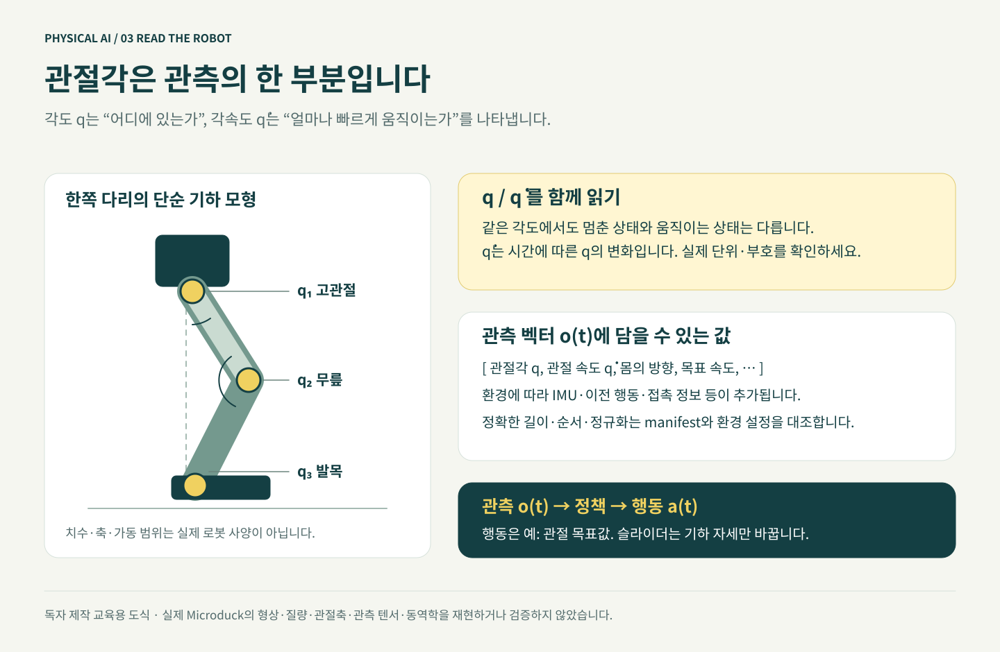

# 진짜 모델을 열고 관측·행동 연결 보기

예상 시간: 20분. AWS에서는 MuJoCo/mjlab 환경을 실행하고 내 컴퓨터의 브라우저로 봅니다. 앞서 연결한 공식 온라인 데모와 이번 단계에서 직접 실행하는 AWS 시뮬레이션을 구분하세요.

[공식 온라인 Microduck 시뮬레이터](../../static/visuals/biped-3d.html)는 Pollen Robotics가 제공하는 별도 브라우저 데모입니다. 인터넷과 제공자 서비스 가용성이 필요하며, 임베드가 열리지 않으면 [공식 Hugging Face Space](https://huggingface.co/spaces/pollen-robotics/microduck-simulator)에 직접 접속하세요. 데모는 내 AWS GPU나 체크포인트, 실제 로봇·모터에 연결하지 않으며 이 워크샵의 학습 성공을 증명하지 않습니다.

아래 실습은 앞 모듈에서 이용 권한을 확인하고 설치한 모델로 진행합니다. 공식 데모를 열었다는 사실만으로 자산 다운로드·학습 권한 확인이나 AWS 환경 점검이 완료되지는 않습니다.



## 먼저 3분: 관절을 움직이며 이해하기

[**관절을 움직이며 이해하기 — 3D 개념 뷰어 열기**](../../static/visuals/joint-concepts-3d.html)

이 작은 뷰어에서는 6개 표시용 관절을 직접 조절합니다. 관절 연결을 이해한 뒤 아래의 실제 MuJoCo 모델과 비교해 보세요.

1. **처음으로 → 측면**을 누릅니다. 왼쪽 무릎은 16°에서 시작합니다.
2. **왼쪽 무릎**만 58°로 바꿉니다. Module 1의 두 번째 3D 그림과 같은 입력값입니다. 고관절 슬라이더는 그대로인데 종아리와 발이 함께 움직이는지 봅니다.
3. **왼쪽 발목**을 바꿔 봅니다. 이번에는 무릎 위쪽이 아니라 발의 방향이 바뀝니다.
4. **처음으로**를 누르고 **굽힌 자세**를 선택합니다. 여러 관절을 함께 바꿨을 때 모양이 어떻게 달라지는지 비교합니다.

**생각해 보기:** 슬라이더의 각도는 “내가 지정한 값”입니다. 실제 제어에서는 정책이 목표값을 내고, 모터·중력·접촉의 영향을 받은 몸 상태를 다시 관측합니다. 이 개념 뷰어는 입력값으로 도형을 바로 그리므로 두 과정의 차이를 계산하지 않습니다. 지면을 뚫거나 균형이 맞지 않는 자세도 그릴 수 있습니다.

공식 Microduck 시뮬레이터는 첫 화면과 이 장의 링크에서 계속 사용할 수 있습니다. 두 뷰어를 번갈아 보며 **관절의 기하 변화**와 **물리 시뮬레이션의 움직임**을 구분해 보세요.

## 1. GPU 호스트에서 뷰어 실행

```bash
cd "$WORKSHOP_ROOT"
python3 scripts/workflow.py preview --repo "$DUCK_REPO" --execute
```

이 명령은 **zero policy**를 사용합니다. 학습하지 않은 동작과 중력의 영향을 보는 점검이며 걷기를 보여 주는 데모가 아닙니다. 로봇이 주저앉거나 종료 후 다시 시작할 수 있습니다.

출력되는 Viser 주소와 포트를 확인하세요. 기본적으로 8080을 사용하지만 이미 사용 중이면 다른 포트가 출력될 수 있습니다. EC2 보안 그룹에 포트를 열지 않습니다.

## 2. 내 컴퓨터에서 SSM 포트 전달

별도 터미널에서 **배포 때 선택한 리전**을 `AWS_REGION`에 다시 설정하고 실제 인스턴스 ID를 넣어 실행합니다. 아래 8080은 서버 로그의 포트와 같아야 합니다.

```bash
aws ssm start-session --region "$AWS_REGION"   --target i-여기에실습인스턴스ID   --document-name AWS-StartPortForwardingSession   --parameters '{"portNumber":["8080"],"localPortNumber":["8080"]}'
```

브라우저에서 `http://localhost:8080`을 엽니다. 이 터널을 실행하는 동안 터미널을 유지합니다. 페이지가 열리지 않으면 인스턴스 상태, SSM 접속, 실제 출력 포트부터 확인합니다.

## 3. 관찰할 것

모델이 완전히 보이는지, 지면이 있는지, 시간이 진행되는지 확인합니다. 머리·다리의 관절 구조와 센서 값이 바뀌는 관계를 봅니다. 이미지가 보여도 학습이 성공한 것은 아닙니다.

확인이 끝나면 GPU 호스트의 뷰어와 내 컴퓨터의 터널을 각각 `Ctrl+C`로 종료합니다. 둘 중 하나만 종료하면 나머지 프로세스는 남을 수 있습니다.

**확인:** 실제 시뮬레이터의 모델·지면·시간 진행을 확인하고 프로세스를 종료했으면 통과입니다.

**기억할 점:** 그림, 물리 시뮬레이션, 학습된 보행은 서로 다른 결과입니다.

[← 설치](../module4-environment/index.ko.md) · [다음: 강화학습 →](../module6-training/index.ko.md)
