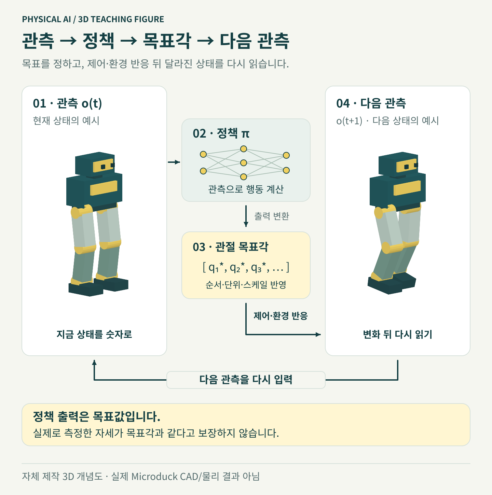

# 먼저 5회 점검, 그다음 학습

예상 시간: 짧은 점검 + 학습 대기. 실제 시간은 GPU·환경 수·수렴 여부에 따라 다릅니다. 공식 README의 시간 추정치를 이번 AWS 구성에서 측정한 결과처럼 사용하지 않습니다.

## 학습 전에 한 번의 제어 과정을 그림으로 보기



그림의 왼쪽 로봇이 현재 상태, 오른쪽은 다음 시점의 상태를 설명합니다. 정책이 정한 목표 관절각과 실제 도달한 관절각은 같지 않을 수 있습니다. 다음 관측이 다시 정책에 들어가므로 매 순간의 차이를 반영하며 움직입니다.

**제어 한 번과 학습 업데이트 한 번은 다릅니다.** 시뮬레이션에서 이런 전이를 여러 환경·여러 시간 단계에 걸쳐 모은 뒤 PPO가 정책을 갱신합니다. 아래의 “5회 업데이트”는 관절을 다섯 번만 움직인다는 뜻이 아닙니다. 그림은 과정 설명용이며 체크포인트의 실행 영상이나 보행 성과가 아닙니다.

## 1. 작은 스모크 실행

GPU 호스트에서 실행합니다.

```bash
cd "$WORKSHOP_ROOT"
python3 scripts/workflow.py smoke --repo "$DUCK_REPO" --execute
```

64개 병렬 환경, PPO 5회 업데이트, seed 42, 매 회 체크포인트 저장을 사용합니다. 콘솔에서 오류·NaN이 없는지 확인하고 종료 코드와 체크포인트를 확인하세요.

```bash
find "$DUCK_REPO/logs/rsl_rl/velocity" -name 'model_*.pt' -type f
```

디렉터리 이름의 `workshop-smoke`가 짧은 점검 결과입니다. 이 모델을 잘 걷는 모델로 취급하거나 실물로 옮기지 않습니다.

## 2. 보행 학습 실행

```bash
python3 scripts/workflow.py train --repo "$DUCK_REPO"   --num-envs 4096 --iterations 3000 --seed 42 --execute
```

3000회는 실습의 첫 관찰 지점이며 성공 기준이 아닙니다. 공식 설정의 최대 반복 횟수와도 다릅니다. 지정한 횟수를 마쳐도 걷지 않으면 원인을 분석하고 추가 실험을 계획해야 합니다.

CUDA 메모리 부족이면 실행을 종료한 뒤 1024, 필요하면 512 등으로 낮춥니다. 환경 수를 바꾸면 학습 데이터 양과 수렴 특성도 바뀌므로 이전 실험과 같은 결과를 기대하지 마세요.

```bash
python3 scripts/workflow.py train --repo "$DUCK_REPO"   --num-envs 1024 --iterations 3000 --seed 42 --execute
```

두 학습을 동시에 시작하지 마세요. GPU 호스트에서 `nvidia-smi`로 실행 중인 프로세스와 메모리를 확인합니다. 실행 중 터미널 연결을 유지하고, 장시간 실행을 서비스나 tmux로 운영할 때는 운영자가 종료 방법도 함께 관리합니다.

## 3. 학습 결과 읽기

학습 경로는 `logs/rsl_rl/velocity/<시간>_workshop-walk/`입니다. `model_*.pt`, 설정, TensorBoard 로그를 보존하세요. 기본 명령은 TensorBoard 로거를 사용하여 별도 W&B 계정 없이 기록합니다.

선택 사항: 같은 학습 환경에서 TensorBoard가 설치되어 있는지 확인한 뒤 실행합니다. 없다면 패키지를 임의 추가해 기준 lock을 바꾸기보다 콘솔 로그와 시뮬레이션 평가를 먼저 사용하세요.

```bash
cd "$DUCK_REPO"
uv run --frozen python -m tensorboard.main --logdir logs/rsl_rl --host 127.0.0.1 --port 6006
```

내 컴퓨터에서 6006을 같은 방식으로 SSM 전달하면 `http://localhost:6006`에서 볼 수 있습니다. 점수 상승만 보지 말고 에피소드 길이·속도 추종과 실제 영상을 함께 봅니다.

## 4. 사용할 체크포인트 직접 지정

```bash
export CHECKPOINT="$DUCK_REPO/logs/rsl_rl/velocity/실제학습폴더/model_실제번호.pt"
test -f "$CHECKPOINT"
```

`실제학습폴더`와 `실제번호`는 위 목록의 값으로 바꿉니다. 이 교재는 가장 최신 파일을 자동으로 골라 배포하지 않습니다. 자신이 만든 신뢰할 수 있는 체크포인트만 사용하세요.

**확인:** 실행 환경·환경 수·seed·반복 횟수·선택 체크포인트를 기록했으면 평가 단계로 넘어갑니다. 아직 실물 준비가 된 것은 아닙니다.

**기억할 점:** “5회 점검 성공”, “3000회 학습 종료”, “보행 평가 통과”는 서로 다른 기록입니다.

[← 시뮬레이션](../module5-simulation/index.ko.md) · [다음: 결과 평가 →](../module7-evaluation/index.ko.md)
