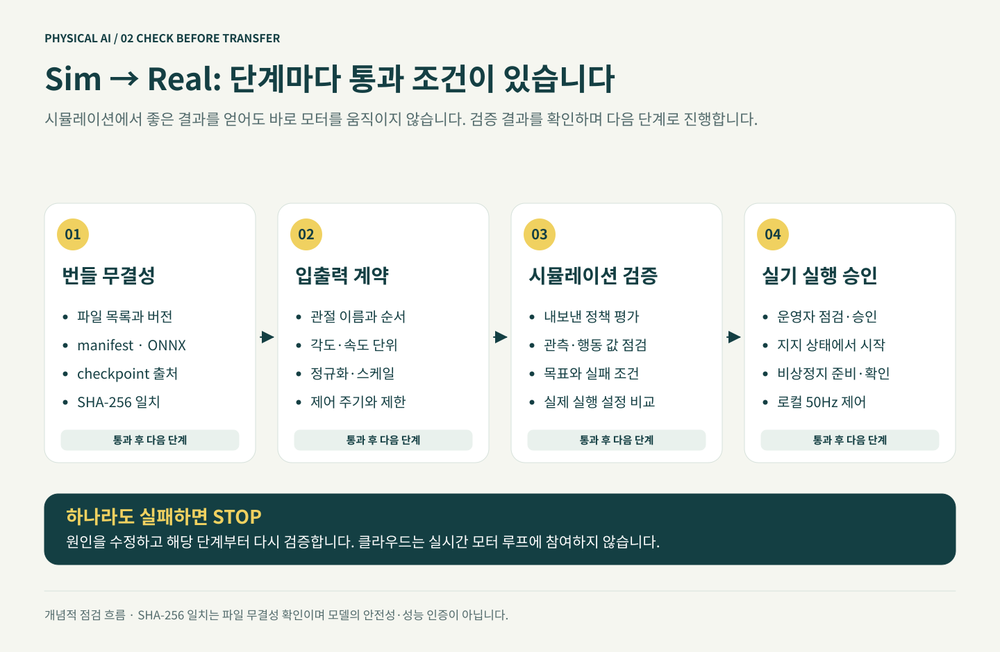

# 점수보다 실제 움직임 확인하기

예상 시간: 30~60분. 실행 위치: GPU 호스트 + 브라우저. 이 단계의 결과가 좋지 않으면 실물 배포를 진행하지 않습니다.



## 1. 선택한 체크포인트 보기

```bash
cd "$WORKSHOP_ROOT"
python3 scripts/workflow.py watch --repo "$DUCK_REPO"   --checkpoint "$CHECKPOINT" --execute
```

모듈 5와 같은 SSM 포트 전달로 Viser를 엽니다. 내 모델이 선택된 체크포인트에서 로드되었는지 콘솔 경로를 확인합니다. 뷰어의 속도 명령 조작을 사용해 정지·저속 전진·회전을 각각 관찰하세요. UI가 다른 버전이면 기준 커밋과 설치 상태를 먼저 확인합니다.

## 2. 확인할 행동

| 시험 | 관찰할 것 | 문제가 있으면 |
|---|---|---|
| 0 속도 | 몸이 심하게 떨리거나 계속 이동하지 않는가 | 정지 성능 미달 기록 |
| 저속 전진 | 명령 방향으로 움직이고 발을 번갈아 디디는가 | 제자리 서기·발 끌림 기록 |
| 속도 줄이기 | 무리한 몸 기울기 없이 속도를 줄이는가 | 제동·균형 문제 기록 |
| 작은 회전 | 원치 않는 점프·비틀림·넘어짐이 없는가 | 회전 학습 범위 검토 |
| 새 에피소드 | 시작 자세가 바뀌어도 지나치게 불안정하지 않은가 | 초기 상태에 과적합 여부 확인 |

넘어졌다가 자동 reset되어 다시 서는 장면을 “넘어지지 않음”으로 세지 마세요. 몸이 이동해도 미끄러지거나 발을 끌고 있으면 보행 성공으로 단정하지 않습니다.

## 3. 기록 남기기

워크샵의 `artifacts/` 아래에 실험별 기록을 둡니다. 파일에 환경·커밋·체크포인트·명령·관찰 기간·넘어짐·떨림·이상 행동과 영상 위치를 기록하세요. 저장 또는 공유하는 영상·모델도 이용 허가 범위를 따릅니다.

다음 모듈에서 ONNX를 만든 뒤, 새 시드로 같은 모델을 수치 평가합니다. **체크포인트 관찰 → ONNX 내보내기 → ONNX 시뮬레이션 평가** 순서로 모델 변환 뒤에도 행동이 유지되는지 확인합니다.

기준 시드 42로 학습했더라도 학습 환경에서 많은 상태를 봅니다. 900·901·902 같은 다른 시드는 점검 범위를 넓히는 도구이며 완전한 일반화 증명이 아닙니다. 평가 시드를 보고 계속 튜닝했다면 최종 검증에는 또 다른 시드를 쓰세요.

**확인:** 정상·실패 사례를 직접 보고 기록했으며, 문제를 숨기지 않고 다음 단계 진행 여부를 결정했다면 통과입니다.

**기억할 점:** 자동 평가가 통과해도 영상 검토와 실제 하드웨어 판단은 남습니다.

[← 학습](../module6-training/index.ko.md) · [다음: ONNX와 전달 묶음 →](../module8-onnx/index.ko.md)
