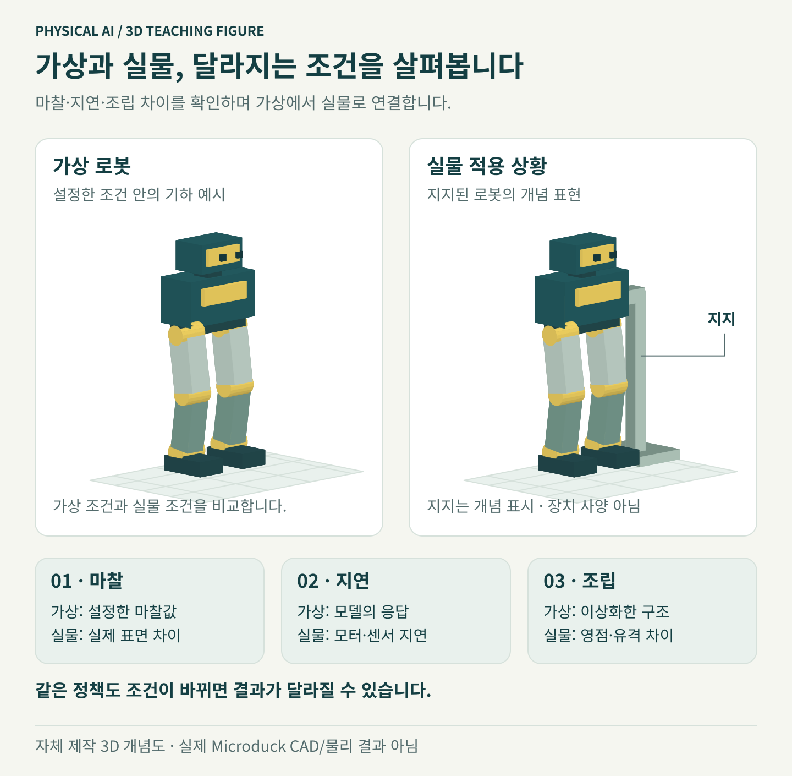

# 실물 단계는 로봇 앞에서 시작합니다

예상 시간: 30분 이상. 실제 Microduck과 운영자가 있어야 합니다. 로봇이 없다면 모듈 8까지 결과를 보존하고 [종료](../module11-cleanup/index.ko.md)로 이동하세요. 실물 동작을 확인했다고 기록하지 않습니다.

## 같은 정책도 실물에서는 다르게 움직일 수 있습니다



시뮬레이터에서는 바닥 마찰과 모터 반응을 설정값으로 표현합니다. 실제 로봇에서는 바닥 재질, 배터리 상태, 통신·제어 지연, 조립·교정 오차가 움직임에 영향을 줍니다. 파일이 정상적으로 로드됐다는 사실만으로 같은 보행을 보장하지 않습니다.

그림의 지지 구조는 “로봇을 지지한 상태에서 준비한다”는 개념 표시입니다. 실제 지지대의 설계나 고정 방법을 제공하는 도면이 아닙니다. 제조사의 절차와 숙련된 운영자의 판단으로 준비한 뒤, 아래 조건을 확인하세요.

## 1. 시작 조건

- 조립·교정된 로봇과 호환되는 공식 런타임이 있습니다.
- 모터·IMU·배터리·게임패드가 제조사 절차에 따라 준비되어 있습니다.
- 평평한 장소, 로봇을 안정적으로 지지할 수 있는 지지대, 즉시 개입할 운영자가 있습니다.
- 시뮬레이션 영상과 ONNX 평가 기록을 검토했고 모델 출처와 해시가 일치합니다.

보드 설치/복구가 필요한 경우 [공식 설치 문서](https://github.com/pollen-robotics/microduck/blob/5620aa214e6e304eec00d5c376ac81d3001fb7a3/docs/robot/install-dev.md)를 사용하세요. 교재의 기준 커밋은 명령 검토 기준이며 판매 로봇을 그 개발 커밋으로 덮어쓰라는 지시가 아닙니다. 하드웨어 리비전·이미지·저장장치를 확인하지 않은 채 플래시하지 않습니다.

## 2. 로봇에 접속하고 현재 상태 확인

같은 로컬 네트워크에서 제조사가 안내한 계정과 호스트로 SSH 접속합니다. 아래 값은 실제 계정·주소로 바꿉니다.

```bash
ssh 로봇사용자@로봇주소
robotctl --help
robotctl health
robotctl policy list
```

`health` 출력과 현재 정책 목록을 보존하세요. `health`의 성공만으로 모터 온도 등 모든 값이 정상 범위라는 의미는 아닙니다. 수치와 경고도 읽어야 합니다. 전원이 켜졌다는 사실과 모터 제어 준비는 다릅니다.

## 3. 정지와 토크 해제의 차이

공식 게임패드에서 스틱을 놓으면 이동 명령이 0이 되고, Start는 상태에 따라 초기 자세 또는 정책 활성/비활성 전환을 합니다. **토크 해제는 몸을 지탱하던 힘을 없애므로 로봇이 주저앉을 수 있습니다.** 제조사 매핑과 설치된 버전에서 동작을 확인하세요.

공식 명령은 다음과 같습니다. 지지대 위에서 운영자가 준비한 경우에만 실행합니다.

```bash
sudo robotctl robot init
```

모든 관절에 토크가 걸리고 약 2초에 걸쳐 초기 자세로 이동합니다. 사람의 손가락과 케이블이 관절에 끼이지 않도록 먼저 정리합니다.

로봇을 지지하고 토크를 해제할 때:

```bash
sudo robotctl robot relax --yes
```

위 명령은 “제자리에서 안전하게 서기” 명령이 아닙니다. 토크가 꺼져 넘어질 수 있습니다. 게임패드 Select도 해당 버전에서는 긴급 토크 해제입니다. 네트워크 명령만을 유일한 개입 경로로 삼지 마세요.

**확인:** 공식 정책에서 초기 자세·조작·정지·지지된 토크 해제를 직접 확인하고 기록했으면 사용자 모델로 넘어갈 수 있습니다.

**기억할 점:** 먼저 제조사 기본 정책과 하드웨어가 정상인지 확인해야 내가 만든 모델의 문제와 구별할 수 있습니다.

[← ONNX](../module8-onnx/index.ko.md) · [다음: 모델 적용과 복구 →](../module10-deploy/index.ko.md)
