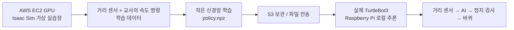

# AWS의 가상 로봇을 내 책상 위 실제 로봇으로

처음부터 로봇 전문가일 필요는 없습니다. 이 워크샵에서는 로봇이 **앞을 보고,
움직일 방향을 결정하고, 실제로 바퀴를 돌리는 과정**을 작은 단계로 완성합니다.

완성할 결과는 **평평한 실내에서 장애물을 보고 천천히 피하는 TurtleBot3 Burger**입니다.
목적지로 찾아가는 내비게이션이나 로봇팔 조작은 후속 과정입니다.

인터넷 연결이 느려져도 로봇의 판단은 로봇 안에서 이루어집니다.
AWS는 시뮬레이션과 학습에 사용하고, 실제 주행 중에는 AWS가 바퀴를 제어하지 않습니다.

교재 중간의 그림으로 [AWS 배포 구성](module2-aws/index.ko.md),
[거리 센서 읽기](module4-data/index.ko.md),
[실물 주행 확인 순서](module8-real-run/index.ko.md)를 확인할 수 있습니다.
HTML 교재에서 그림을 누르면 크게 열립니다.

## 따라오는 방법

모든 명령에는 실행 위치가 있습니다. 터미널을 세 개로 나누고 제목을 붙이세요.

| 표시 | 어디인가요? | 주로 하는 일 |
|---|---|---|
| **내 노트북** | Mac / Linux / Windows WSL2 | AWS 생성, 파일 전송 |
| **AWS EC2** | SSH로 접속한 Ubuntu 서버 | Isaac Sim, 데이터 수집, 학습 |
| **로봇** | Raspberry Pi로 SSH 접속 | 센서 확인, 모델 실행 |

`<값>` 표시는 그대로 붙여넣지 말고 자신의 값으로 바꿉니다.
각 페이지의 **완료 확인**을 통과한 다음 페이지로 이동합니다.
명령이 동작하지 않으면 반복 실행하기 전에 해당 페이지의 해결 방법을 확인하세요.

## 오늘의 경로

1. [센서·시뮬레이터·모델 이해](introduction/index.ko.md)
2. [전날 준비](module1-preflight/index.ko.md)
3. [AWS GPU 만들기](module2-aws/index.ko.md)
4. [Isaac Sim 실행](module3-simulation/index.ko.md)
5. [가상 주행 데이터 수집](module4-data/index.ko.md)
6. [내 첫 주행 모델 학습](module5-training/index.ko.md)
7. [가상 검증과 실물 전환 조건](module6-evaluation/index.ko.md)
8. [실제 로봇 준비와 모델 배포](module7-device/index.ko.md)
9. [그림자 실행부터 저속 주행까지](module8-real-run/index.ko.md)
10. [비용 정리와 다음 도전](module9-cleanup/index.ko.md)
11. [막혔을 때 찾는 표](troubleshooting/index.ko.md)

## 이 자료의 상태

실행 코드와 인프라 템플릿을 포함합니다. 로컬에서 확인한 항목과 실제 GPU·하드웨어가
있어야 확인할 항목은 [검증 기록](../docs/verification.md)에 구분해 두었습니다.
운영자는 [리허설 가이드](../docs/facilitator.md)로 사전 실행을 완료한 뒤 행사를 여세요.

**기억할 점:** 가상 환경에서 학습한 모델을 실물에 옮길 때는 센서 좌표·속도·정지 조건부터 확인합니다.

[다음: Physical AI 이해](introduction/index.ko.md)
